# InMap 🗺️

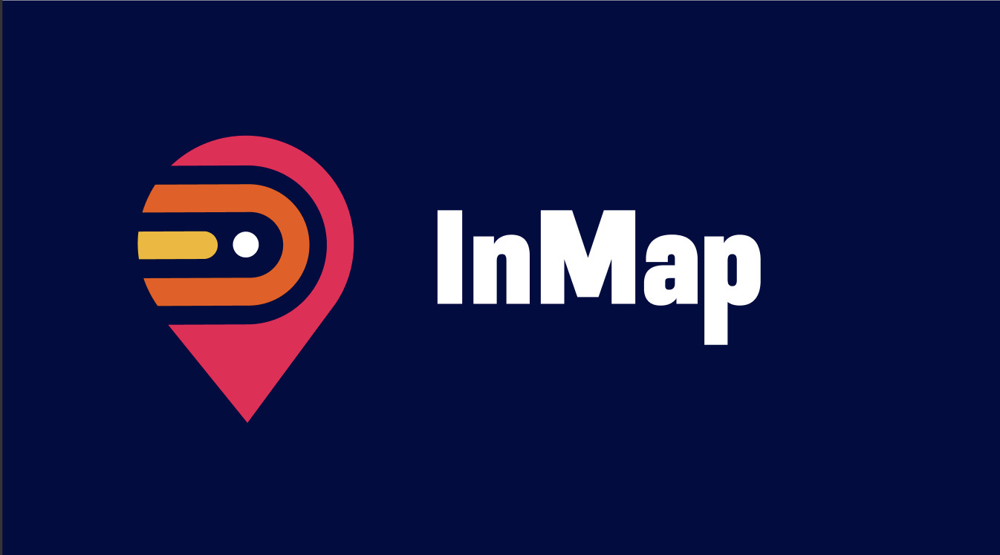

# Description
**_InMap_** redefines mall navigation on your mobile device. Discover malls, explore shops with detailed information and exclusive offers, and easily find parking and entrances. The highlight? Effortless indoor navigation, guiding you from one shop to another with precision, whether by stairs or elevators. With a suite of features tailored for convenience, InMap transforms every shopping trip into a seamless experience.InMap redefines mall navigation on your mobile device. Discover malls, explore shops with detailed information and exclusive offers, and easily find parking and entrances. The highlight? Effortless indoor navigation, guiding you from one shop to another with precision, whether by stairs or elevators. With a suite of features tailored for convenience, InMap transforms every shopping trip into a seamless experience.

## Responsibilites

- Engineered robust backend systems to seamlessly integrate mall data, including shop details, shops branches, offers... etc.

- Integrated navigation data with navigation part team to ensure great correspondence between backend & navigation team.
  
- Integrated 3rd party plugins such as notifications, SMS | Whatsapp messages providers and others.
  
- Maintained continuous monitoring and optimization of backend performance, ensuring responsiveness and
scalability to accommodate a growing user base.

- Ensured CI/CD of the project (Docker, Gitlab CI/CD pipelines, AWS EB).

## Used Technologies

- FastifyJS (Node.js framework)
- PostgreSQL.
- Amazon web services.
    - EC2
    - S3
    - RDS.
    - Auto scaling.
    - Elastic Beanstalk.

## Some Mobile App Screenshots
  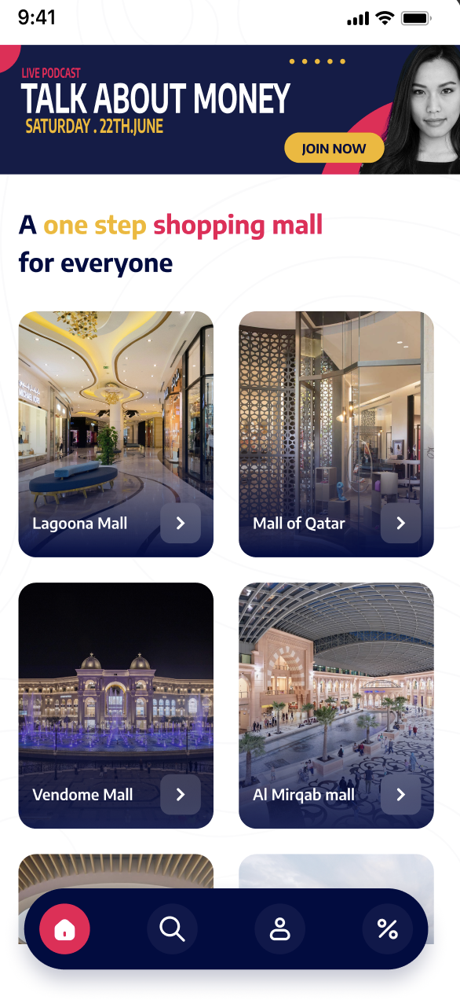
  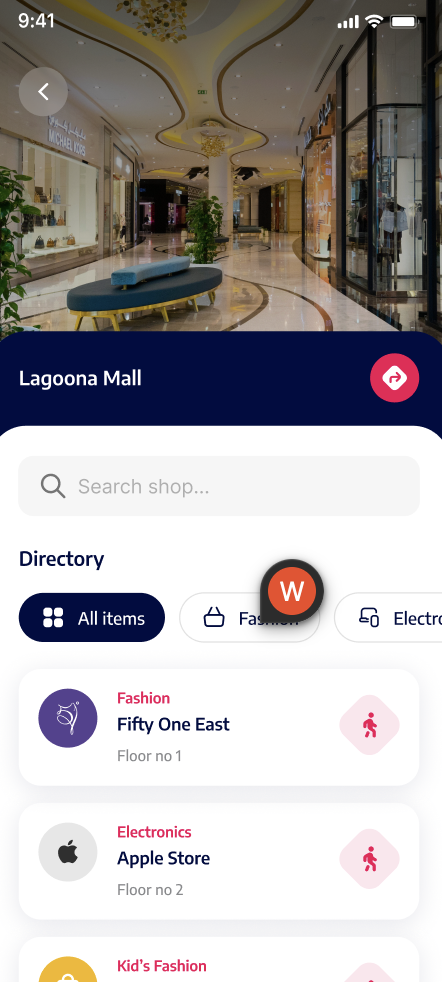
  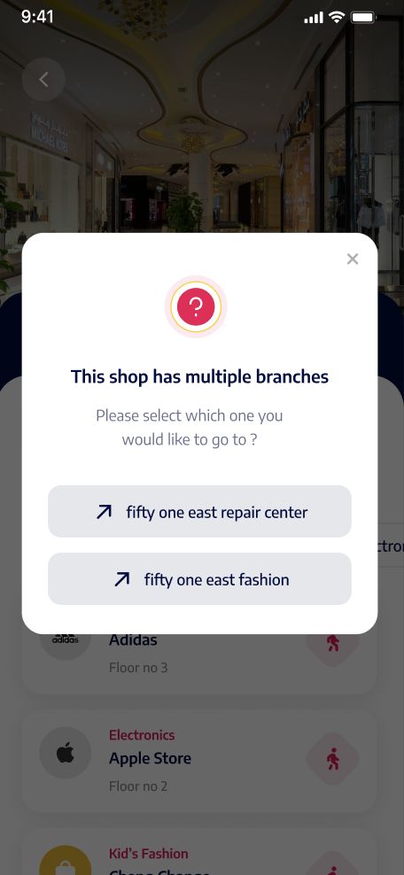
  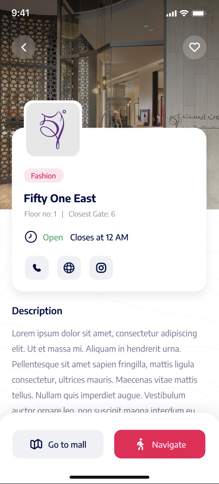
  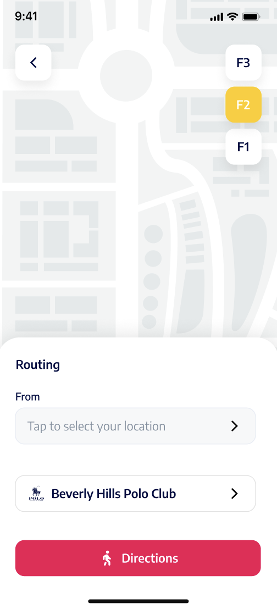
  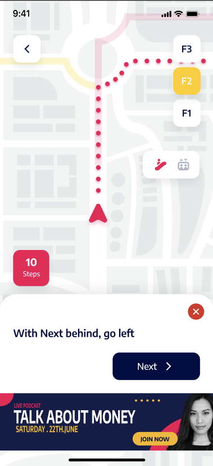
  
  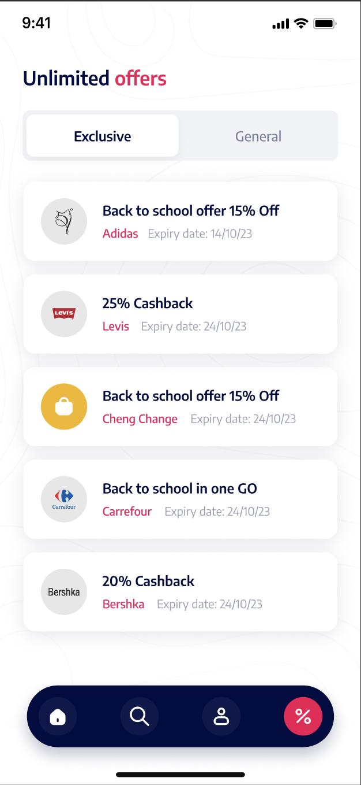

## Some Dashboard Screenshots
  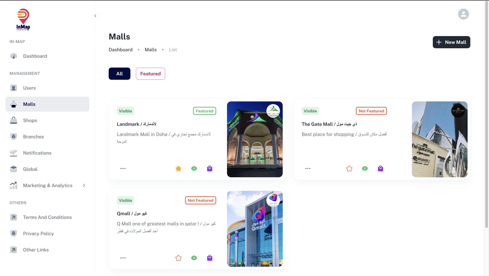
  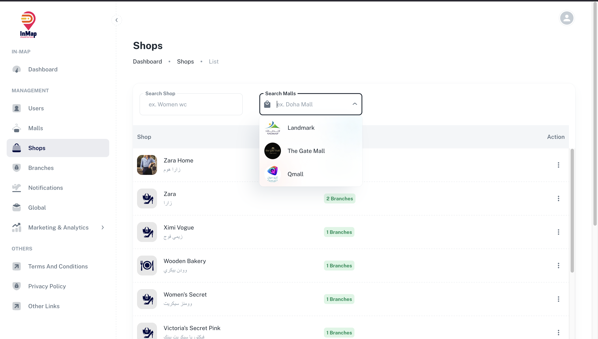
  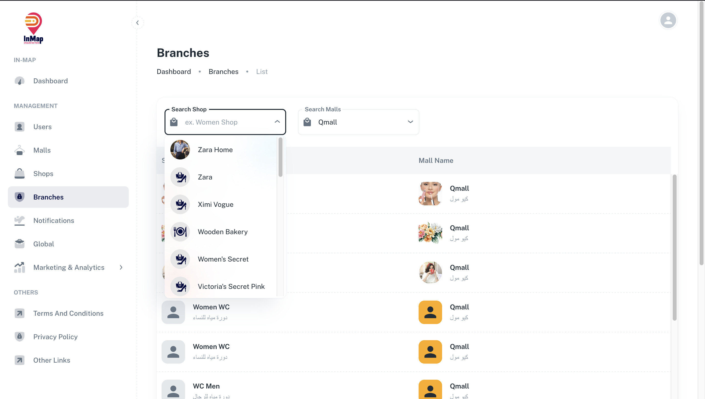
  
